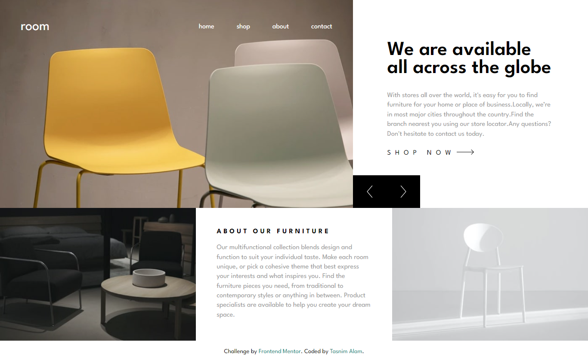
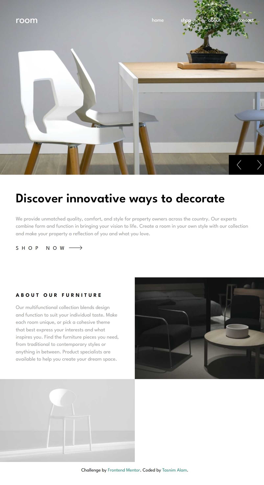
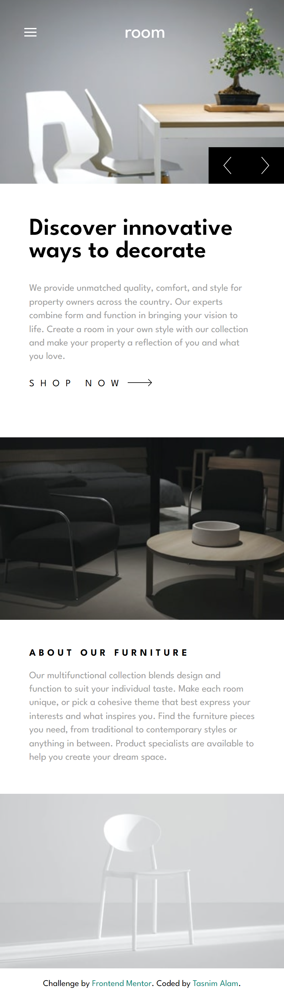

# Frontend Mentor - Room homepage solution

This is a solution to the [Room homepage challenge on Frontend Mentor](https://www.frontendmentor.io/challenges/room-homepage-BtdBY_ENq). Frontend Mentor challenges help you improve your coding skills by building realistic projects. 

## Table of contents

- [Overview](#overview)
  - [The challenge](#the-challenge)
  - [Screenshot](#screenshot)
  - [Links](#links)
- [My process](#my-process)
  - [Built with](#built-with)
  - [What I learned](#what-i-learned)
- [Author](#author)

## Overview

### The challenge

Users should be able to:

- View the optimal layout for the site depending on their device's screen size
- See hover states for all interactive elements on the page
- Navigate the slider using either their mouse/trackpad or keyboard

### Screenshot






### Links

- Solution URL: [Repository]()
- Live Site URL: [Live Preview]()

## My process

### Built with

- Semantic HTML5 markup
- Flexbox
- CSS Grid


### What I learned
I tried a different approach to build a slider. It initializes variables to control the slider, including the header element, previous and next buttons, and an array of image URLs. It also sets an initial index (i) to 0.

If the window's inner width is less than or equal to 500 pixels, the code updates the image URLs to use smaller images, and it initially displays the first image in the header.

The code adds event listeners to the "next" and "previous" buttons, which call the moveForward and moveBackward functions when clicked. These functions increment or decrement the index (i) and update the header's background image accordingly, creating a slideshow effect.

```js
const header = document.querySelector('header')
const previousButton = document.getElementById('previous')
const nextButton = document.getElementById('next')

let imageURLs = ['images/desktop-image-hero-1.jpg', 'images/desktop-image-hero-2.jpg', 'images/desktop-image-hero-3.jpg']

let i = 0

// Show smaller images for smaller screens
if (window.innerWidth <= 500) {
    imageURLs = ['images/mobile-image-hero-1.jpg', 'images/mobile-image-hero-2.jpg', 'images/mobile-image-hero-3.jpg']

    header.style.backgroundImage = `url(${imageURLs[i]})`

}

// Initially update DOM with the first item
header.style.backgroundImage = `url(${imageURLs[i]})`

nextButton.addEventListener('click', moveForward)
previousButton.addEventListener('click', moveBackward)

function moveForward() {
    i++
    if (i >= imageURLs.length) {
        i = 0
    }

    header.style.backgroundImage = `url(${imageURLs[i]})`
}

function moveBackward() {
    i--
    if (i < 0) {
        i = imageURLs.length - 1
    }
    header.style.backgroundImage = `url(${imageURLs[i]})`
}
```

## Author
- Website - [Tasnim Alam](https://github.com/Tasnim005)
- Frontend Mentor - [Tasnim005](https://www.frontendmentor.io/profile/Tasnim005)
